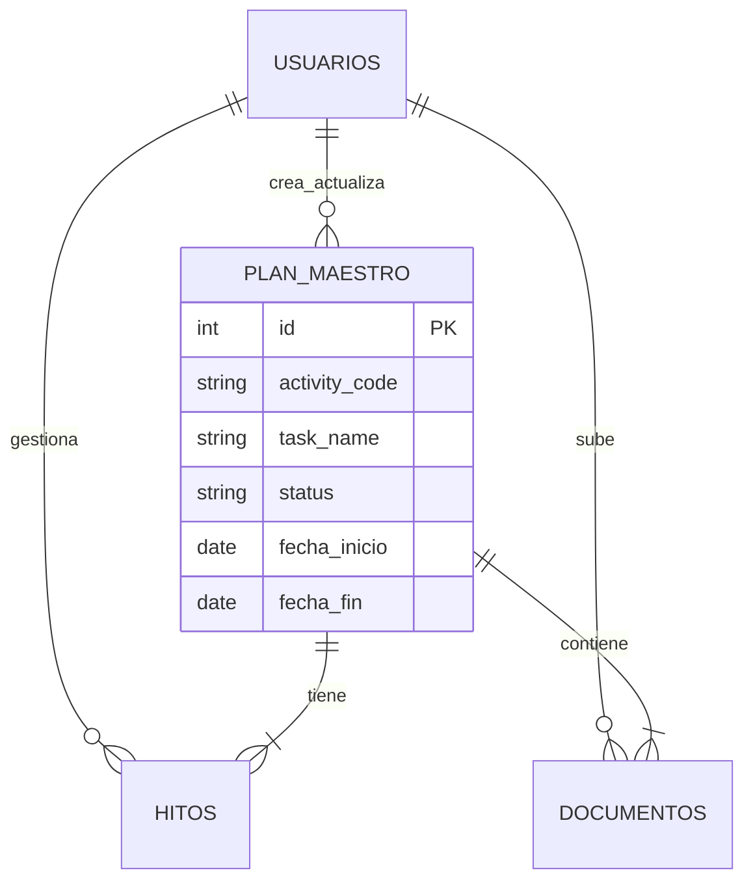

# Modelo de Datos - Proyecto GWP

Este documento describe la estructura de base de datos diseñada para la gestión del Plan Maestro de Consultorías.

## Resumen Ejecutivo

El modelo ha sido diseñado priorizando la simplicidad operativa y la integridad de los datos de auditoría. Se ha optado por una estructura parcialmente desnormalizada en la entidad principal para facilitar la carga y consulta directa, complementada con estructuras relacionales para la gestión de hitos y documentación adjunta.

## Entidades Principales

### 1. Usuarios (`usuarios`)
Gestiona el acceso y la trazabilidad de las operaciones.
- **Roles**: Admin, Coordinador, Finanzas, Legal, etc.
- **Propósito**: Auditoría de creación y actualización de registros.

### 2. Plan Maestro (`plan_maestro`)
Tabla central que consolida toda la información operativa del proyecto.
- **Diseño**: Desnormalizado. Contiene todos los campos funcionales (Actividades, Fechas, Responsables) en una sola estructura plana.
- **Auditoría**: `created_by`, `updated_by`, `created_at`, `updated_at`.
- **Claves**: `id` (PK), `activity_code` (Referencia externa).

### 3. Hitos (`hitos`)
Permite el desglose granular de entregables o eventos clave por actividad.
- **Relación**: Muchos a Uno (N:1) con `plan_maestro`.
- **Trazabilidad**: Integrada con usuario responsable.

### 4. Documentos (`documentos`)
Repositorio de evidencias y archivos adjuntos por actividad.
- **Relación**: Muchos a Uno (N:1) con `plan_maestro`.
- **Metadatos**: Tipo de archivo, URL/Ruta, Usuario que subió el archivo.

## Diagrama Relacional Simplificado

## Instrucciones de Implementación

El script SQL completo se encuentra en `schema.sql`. Para desplegar:

1. Asegurar acceso a una instancia PostgreSQL.
2. Ejecutar el script `schema.sql`.
